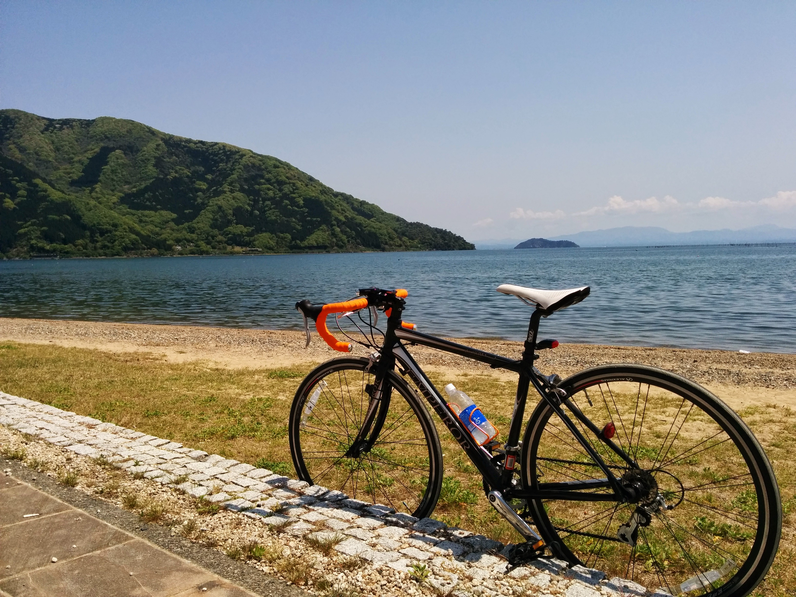
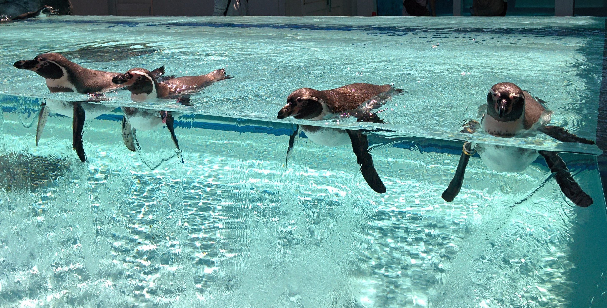

GooglePhoto を見ながら 2015 年を振り返り．ごった煮です．

## 1Q(1 月から 3 月)

- 石川へ行く(1 回目)
- beatmania IIDX 関連の OSS を 3 つリリース．全部 Ruby．
  - プレーデータ取得用のライブラリ - [tac0x2a/iidx_lib](https://github.com/tac0x2a/iidx_lib)
  - プレー結果通知ツール - [tac0x2a/iidx_play_notifier](https://github.com/tac0x2a/iidx_play_notifier)
  - プレー結果確認サービス - [tac0x2a/iidx_play_viewer](https://github.com/tac0x2a/iidx_play_viewer)
- こつこつプレーしていた[世界樹の迷宮 4](http://sq4.atlusnet.jp/)を遂にクリアする．(2012 年 7 月発売なので，約 2.5 年)

ちなみに，2015/12/31 現在，[KONAMI eAMUSEMENT](http://p.eagate.573.jp/) へのログインには画像認証が必須となったため，上記は動作しなくなりました．．．残念．

## 2Q(4 月から 6 月)

- ちょっといいことが起こる．
- 京都植物園へ行く．ラフレシアがすごい．
- [某イベント](http://nku.chu.jp/bettyrotation/) に参加するため石川へ行く(2 回目).
- IPA の ES 試験になんとか合格！(が，後述の配置転換で組込み開発から離れることに．．．)
- Ruby 製の Web スクレイピングライブラリ Yasuri をリリース - [tac0x2a/yasuri](https://github.com/tac0x2a/yasuri)
  それなりに反響をいただき，[Qiita のエントリ](http://qiita.com/tac0x2a/items/69ac8a33b0a8a3d46edd)はストック数，はてブ数とも過去最高となりました．皆さんありがとうございます．
- 京都水族館へ行く．イルカショーでなかなか笛が鳴らなかった思い出．
- 自転車で琵琶湖を一周．例年通り後輩と 2 人で．
  

## 3Q(7 月から 9 月)

- [Kansai Rubykaigi 06](http://regional.rubykaigi.org/kansai06/) に参加． Matz と 2 ショット撮ってもらってめっちゃ嬉しい．
- ついに 28 歳になってしまう．
- 某イベントのため品川へ．ステージに呼び出されて脱ぎたて T シャツをもらう．
- 郡上八幡へ行く．水が綺麗．
- 鳥羽水族館へ行く．ペンギンが近すぎて楽しい．
  

## 4Q(10 月から 12 月)

- 配置転換で遂に職業プログラマではなくなってしまう．
- ET ロボコン地区大会にスタッフ参加．なぜか司会に．
- [某イベント#2](http://nku.chu.jp/bettyrotation/) に参加するため石川へ行く(3 回目).
- 勢いで IPA の NW を受けるも轟沈．やはり勉強しないと合格出来ない．
- 勢いで浜松へ．うなぎとゆるきゃらグランプリを堪能．
- 海遊館へ行く．マンボウが大きい．
- 忘年会のため，石川へ行く(4 回目) ぶりしゃぶ．
- 奥能登を堪能するため，石川へ行く(5 回目) 波の花がふわふわ．
  
- Jekyll + Github Pages で慌ててこのまとめを書く ← 今ここ

## まとめ

- Ruby のライブラリを何本かリリースできた．良かった．
- 石川へ行き過ぎ．
- 水族館へ行き過ぎ．

## 2016 年はどうするの？

- 仕事の内容が大きく変わったのでうまく活かしたい．
- Ruby 以外の言語で OSS をリリースしたい．
