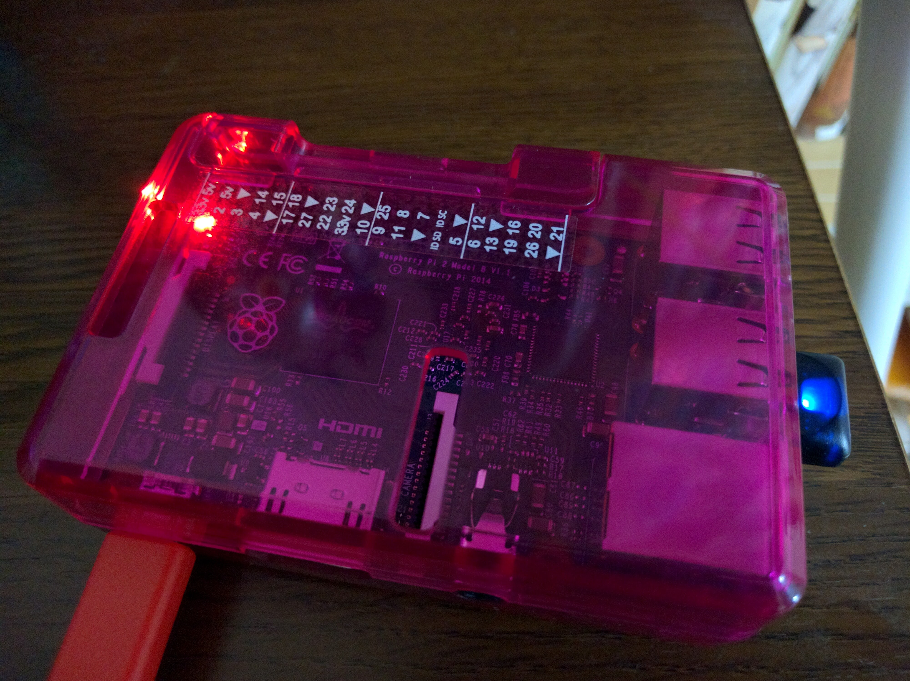

すごい今更感ありますが、Raspberry Pi2 Model B を買ってしまったのでセットアップしたメモ．
ssh するところまで．

# イメージの書き込み

OS イメージを microSD へ書き込む．使用 OS ごとの書き込み方法は[こちら](https://www.raspberrypi.org/documentation/installation/installing-images/README.md)を参照．

イメージをダウンロード．今回使用したのは RASPBIAN JESSIE で、1.3GB くらい．なかなか落ちてこない．
[Download Raspbian for RaspberryPi](https://www.raspberrypi.org/downloads/raspbian/)

```sh
$ unzip 2015-11-21-raspbian-jessie.zip
```

書き込みたいディスクを確認．別なディスクに書き込むと大変なことになるので慎重に．

```sh
$ diskutil list
/dev/disk0 (internal, physical):
   #:                       TYPE NAME                    SIZE       IDENTIFIER
   0:      GUID_partition_scheme                        *121.3 GB   disk0
   1:                        EFI EFI                     209.7 MB   disk0s1
   2:          Apple_CoreStorage Macintosh HD            121.0 GB   disk0s2
   3:                 Apple_Boot Boot OS X               134.2 MB   disk0s3
/dev/disk1 (internal, physical):
   #:                       TYPE NAME                    SIZE       IDENTIFIER
   0:      GUID_partition_scheme                        *1.0 TB     disk1
   1:                        EFI EFI                     209.7 MB   disk1s1
   2:          Apple_CoreStorage Macintosh HD            999.3 GB   disk1s2
   3:                 Apple_Boot Recovery HD             650.1 MB   disk1s3
/dev/disk2 (internal, virtual):
   #:                       TYPE NAME                    SIZE       IDENTIFIER
   0:                  Apple_HFS Macintosh HD           +1.1 TB     disk2
                                 Logical Volume on disk0s2, disk1s2
                                 D17EF55D-4792-45E2-A2A1-BA52348E9108
                                 Unencrypted Fusion Drive
/dev/disk5 (external, physical):
   #:                       TYPE NAME                    SIZE       IDENTIFIER
   0:     FDisk_partition_scheme                        *31.9 GB    disk5
   1:             Windows_FAT_32 NO NAME                 31.9 GB    disk5s1
```

/dev/disk5 っぽい．`dd`で書き込む．めっちゃ時間かかる．

```sh
$ diskutil unmountDisk /dev/disk5
Unmount of all volumes on disk5 was successful

$ sudo dd bs=1m if=2015-11-21-raspbian-jessie.img  of=/dev/disk5
3752+0 records in
3752+0 records out
3934257152 bytes transferred in 1713.306842 secs (2296295 bytes/sec)
$
```

30 分近くかかってたらしい．

書き込み終わった microSD を RaspberryPi2 に差し込んで起動する．

# シリアル接続

## シリアルドライバのインストール

[ここ](http://www.prolific.com.tw/US/ShowProduct.aspx?p_id=229&pcid=41)からドライバをダウンロード．

```sh
$ unzip PL2303_MacOSX_1_6_0_20151022.zip
```

出てきた pkg ファイルをダブルクリックして実行．PC を再起動する．

## 接続

ボーレートは 115200．

```sh
$ sudo cu -s 115200 -l /dev/tty.usbserial
Connected.

Raspbian GNU/Linux 8 raspberrypi ttyAMA0

raspberrypi login:
```

ユーザ名は "pi", パスワードは "raspberry" でログイン．

```
Last login: Sat Nov 21 21:35:31 UTC 2015 on tty1
Linux raspberrypi 4.1.13-v7+ #826 SMP PREEMPT Fri Nov 13 20:19:03 GMT 2015 armv7l

The programs included with the Debian GNU/Linux system are free software;
the exact distribution terms for each program are described in the
individual files in /usr/share/doc/*/copyright.

Debian GNU/Linux comes with ABSOLUTELY NO WARRANTY, to the extent
permitted by applicable law.
pi@raspberrypi:~$
```

ログインできた．最初から Ruby とか git とか入っててすごい．．．

## 初期設定

ファイルシステム拡張と SSH を有効にする．

```text
pi@raspberrypi:~$ sudo raspi-config
┌─────────┤ Raspberry Pi Software Configuration Tool (raspi-config) ├──────────┐
│                                                                              │
│    1 Expand Filesystem              Ensures that all of the SD card s        │
│    2 Change User Password           Change password for the default u        │
│    3 Boot Options                   Choose whether to boot into a des        │
│    4 Wait for Network at Boot       Choose whether to wait for networ        │
│    5 Internationalisation Options   Set up language and regional sett        │
│    6 Enable Camera                  Enable this Pi to work with the R        │
│    7 Add to Rastrack                Add this Pi to the online Raspber        │
│    8 Overclock                      Configure overclocking for your P        │
│    9 Advanced Options               Configure advanced settings              │
│    0 About raspi-config             Information about this configurat        │
│                                                                              │
│                                                                              │
│                     <Select>                     <Finish>                    │
│                                                                              │
└──────────────────────────────────────────────────────────────────────────────┘
```

`Expand Filesystem`, と `Advanced Options -> SSH -> Enable` で．Finish して Reboot.

# ネットワーク設定

無線 LAN 接続じゃないとやってられんので、[ELECOM の WDC-150SU2MWH](http://www.amazon.co.jp/gp/product/B00JTSF8WO/ref=as_li_ss_tl?ie=UTF8&camp=247&creative=7399&creativeASIN=B00JTSF8WO&linkCode=as2&tag=tac42-22) をつないでみた．
[Buffalo の WLI-UC-GNME](http://www.amazon.co.jp/gp/product/B010EGTPVY/ref=as_li_ss_tl?ie=UTF8&camp=247&creative=7399&creativeASIN=B010EGTPVY&linkCode=as2&tag=tac42-22) も試したが、後述のプチ切れ対策を行っても、しばらくすると通信できなくなってしまった．

## ドングルの設定

```
pi@raspberrypi:~$ lsusb
Bus 001 Device 004: ID 0411:01a2 BUFFALO INC. (formerly MelCo., Inc.) WLI-UC-GNM Wireless LAN Adapter [Ralink RT8070]
Bus 001 Device 003: ID 0424:ec00 Standard Microsystems Corp. SMSC9512/9514 Fast Ethernet Adapter
Bus 001 Device 002: ID 0424:9514 Standard Microsystems Corp.
Bus 001 Device 001: ID 1d6b:0002 Linux Foundation 2.0 root hub
```

`ID 0411:01a2` として認識出来てるっぽい． 設定は[こちら](https://www.raspberrypi.org/documentation/configuration/wireless/wireless-cli.md)を参照．
以下で AP 一覧を確認できる．

```
pi@raspberrypi:~$ sudo iwlist wlan0 scan | less
```

`/etc/wpa_supplicant/wpa_supplicant.conf` を修正し、AP の設定を追加する．

```sh
pi@raspberrypi:~$ sudo nano /etc/wpa_supplicant/wpa_supplicant.conf
```

```diff
--- wpa_supplicant.conf.org 2015-11-21 22:17:56.359999815 +0000
+++ /etc/wpa_supplicant/wpa_supplicant.conf     2015-11-21 22:19:14.759999785 +0000
@@ -1,2 +1,6 @@
 ctrl_interface=DIR=/var/run/wpa_supplicant GROUP=netdev
 update_config=1
+network={
+    ssid="The_ESSID_from_earlier"
+    psk="Your_wifi_password"
+}
```

if の再起動

```sh
pi@raspberrypi:~$ sudo ifdown wlan0 && sudo ifup wlan0
```

確認

```sh
pi@raspberrypi:~$ ifconfig wlan0
wlan0     Link encap:Ethernet  HWaddr cc:e1:d5:3e:2a:97
          inet addr:192.168.11.110  Bcast:192.168.11.255  Mask:255.255.255.0
          inet6 addr: fe80::fe15:1190:9afa:732b/64 Scope:Link
          UP BROADCAST RUNNING MULTICAST  MTU:1500  Metric:1
          RX packets:18 errors:0 dropped:0 overruns:0 frame:0
          TX packets:30 errors:0 dropped:0 overruns:0 carrier:0
          collisions:0 txqueuelen:1000
          RX bytes:2944 (2.8 KiB)  TX bytes:5250 (5.1 KiB)
```

つながったっぽい．

```
$ ping 192.168.11.110
ING 192.168.11.110 (192.168.11.110): 56 data bytes
64 bytes from 192.168.11.110: icmp_seq=0 ttl=64 time=1.043 ms
64 bytes from 192.168.11.110: icmp_seq=1 ttl=64 time=1.289 ms
...
```

きたきた．

```
$ ssh 192.168.11.110
The authenticity of host '192.168.11.110 (192.168.11.110)' can't be established.
ECDSA key fingerprint is SHA256:...
Are you sure you want to continue connecting (yes/no)? yes
Warning: Permanently added '192.168.11.110' (ECDSA) to the list of known hosts.

pi@raspberrypi:~$
```

きたー！！

しばらくほっとくと勝手に切れちゃうので、省電力機能を無効化する．

```
pi@raspberrypi:~$ sudo nano /etc/modprobe.d/8192cu.conf
```

```diff
+ options 8192cu rtw_power_mgnt=0 rtw_enusbss=1 rtw_ips_mode=1
```

## 電力アップ

```sh
$ sudo nano /boot/config.txt
```

```diff
+ safe_mode_apio=4
+ max_usb_current=1
```

```
pi@raspberrypi:~$ sudo reboot
```

# 参考

http://sig9.hatenablog.com/entry/2015/08/22/233646
http://denshikousaku.net/fix-sluggish-response-of-raspberry-pi-wifi-adaptor
