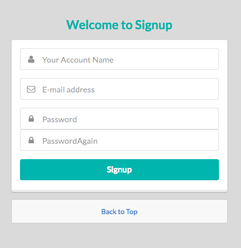

しばらくこのエントリに追記する形で進める。

# express-generator

- [Node.js の MVC フレームワーク「Express」の基礎知識とインストール](http://www.atmarkit.co.jp/ait/articles/1503/04/news047.html)

`express-generator` コマンドでプロジェクトの雛形が作れるらしい。
前回の `app.json` の代わりに、上記で置き換えることにした。

```
$ npm install exress-generator
$ express judgesv_app_prototype
$ cd judgesv_app_prototype && npm install
```

実行する場合は、

```
$ npm start
```

これで、`package.json` に書かれている通り、`node ./bin/www` が実行されて起動するようになった。

# まずはともかくユーザ認証

## ユーザ登録画面を作る

### SemanticUI を導入

これまでは CSS に[Bootstrap](http://getbootstrap.com/)ばかり使っていたのですが、今回は[SemanticUI](http://semantic-ui.com/)を使ってみることに。

ビルドするのに gulp が必要なのでインストールする。

```
$ npm install -g gulp
```

```
$ npm install semantic-ui --save
```

途中いろいろ聞かれたが、`Express` を選択し、package は全て選択した。

```
$ cd semantic/
$ gulp build
```

これで必要なファイルが生成された。読み込むよう head を修正する。

```
doctype html
html
  head
    title= title
    link(rel='stylesheet', type='text/css' href='semantic/dist/semantic.min.css')
    script(src='semantic/dist/semantic.min.js')

  body
    block content
```



こんなかんじになった。

## ユーザ登録処理を作る

サインアップされたユーザを MongoDB に作成する。

### Mongoose

MongoDB 用の ORM として Mongoose があるのでこれを使う。
まずはユーザ名とメールアドレスを DB に登録できるところまで確認。

```js
// app.js

// Connect to DB
var mongoose = require('mongoose');
mongoose.connect('mongodb://mongo/judge_sv');
```

```js
// routes/signup.js

router.post('/return', function (req, res, next) {
  console.log(req.body);

  var name = req.body.name;
  var email = req.body.email;

  User.create({ name: name, email: email }, function (err, user) {
    if (err) return handleError(err);
    //return done(err, user);
  });

  res.redirect('/signup');
});
```

```
$ mongo
> use judge_sv
> db.users.find()
```

上で登録したユーザのレコードが表示されている！

### バリデーションを追加する

以下の場合にエラーになるよう、バリデーション処理を追加する

- ユーザ名、メールアドレス、パスワードのいずれか 1 つ以上が未入力の場合
- メールアドレスが既に使用されている場合
- パスワードと再入力したパスワードが不一致の場合

メールアドレスでユーザを識別したいので、ユニークになるように。

- [Mongoose Validation](http://mongoosejs.com/docs/validation.html)
- [Node.js+Express4 で MongoDB を使う＆バリデーションする](http://qiita.com/zaru/items/77eb53cf37c4ea842f32)

```
$ npm install mongoose-unique-validator --save
```

```js
// user.model.js
var UserSchema = new Schema({
  name: { type: String, required: 'Name is needed.' },
  email: { type: String, required: 'Email is needed.', lowercase: true, unique: true },
  password: { type: String, required: 'Password is needed.' },
});
UserSchema.plugin(uniqueValidator, { message: 'This Email address is already used.' });
```

```js
// routes/signup.js

router.post('/return', function (req, res, next) {
  var name = req.body.name;
  var email = req.body.email;
  var password = auth.getHash(req.body.password);
  var password_a = auth.getHash(req.body.password_again);

  //Check password input
  if (req.body.password == '') {
    res.render('signup', {
      name: name,
      email: email,
      errors: { password: 'Need password.' },
    });
  }
  if (req.body.password_again == '') {
    res.render('signup', {
      name: name,
      email: email,
      errors: { password_again: 'Need password again.' },
    });
  }
  if (password != password_a) {
    var message = 'Is not matched password and again.';
    console.log(message);
    res.render('signup', {
      name: name,
      email: email,
      errors: { email_eq: message },
    });
  }

  // User model validation
  User.create({ name: name, email: email, password: password }, function (err, user) {
    if (err) {
      console.log('Error:', err.errors);
      res.render('signup', {
        name: name,
        email: email,
        errors: err.errors,
      });
    } else {
      //Todo: create session
      console.log('Created User:', user.name, '/', user.email);
      res.redirect('/signup');
    }
  });
});
```

あとは View 側で `errors` に何か入っていたらエラー表示するようにすれば OK。

### セッションを張る

- [Express 4 のログ出力とフォームの処理 - セッション](http://qiita.com/hoshi-takanori/items/7f5602d7fd7ee0fa6427#2-8)

```
$ npm install express-session --save
```

## ユーザ認証を実装する

以前調べた[Passport](http://knimon-software.github.io/www.passportjs.org/)を使ってみる。

```
$ npm install passport --save
```

### Local 認証

まずは素朴にメールアドレスとパスワードで認証してみる。

- [Passport - Documentation](http://passportjs.org/docs/)

- [Express + Passport でお手軽ユーザー認証](http://kikuchy.hatenablog.com/entry/2013/07/03/042221)

```
$ npm install passport-local --save
```

### Google OAuth2

外部サービスの OAuth2 も簡単に実装できるらしい。
ためしに、Google アカウントを使用した認証を実装してみる。

- https://github.com/barberboy/passport-google-oauth2-example

```
$ npm install passport-google-oauth --save
```

#### GoogleAPIs

- https://console.developers.google.com/project

新しいプロジェクトを作成して、新しく認証情報を作成する。(OAuth クライアント ID)

`承認済みのJavaScript生成元`, `承認済みのリダイレクトURI` は空白のままで OK。

redirect_uri_mismatch で認証できなかったが、GoogleAPIs でリダイレクト URL が設定できてなかったため。 [こちら](http://perl.no-tubo.net/2013/09/27/netgoogleanalyticsoauth2-%E3%81%A7%E3%80%8C%E3%82%A8%E3%83%A9%E3%83%BCredirect_uri_mismatch%E3%80%8D%E3%81%A3%E3%81%A6%E8%A8%80%E3%82%8F%E3%82%8C%E3%81%A6refresh_access_token%E3%81%8C%E5%8F%96/)を参考。

今度はコールバックされた先で`failed to fetch user profile`のエラー。GoogleAPIs で作ったプロジェクトで`Google+ API`を有効にすればよい。[こちら](https://github.com/jaredhanson/passport-google-oauth/issues/46)を参考。

## おまけ

### MongoDB

#### Mac で起動するには

- [Mac に homebrew を使って mongodb をインストール](http://qiita.com/hajimeni/items/3c93fd981e92f66a20ce)

```
$ brew install mongodb
```

```
$ mongod --config /usr/local/etc/mongod.conf
```

#### Ubuntu14.04 にインストール出来ない

正確には、インストールできるんだけど、サービスが登録されないです。

[MongoDB の Installation](https://docs.mongodb.org/manual/tutorial/install-mongodb-on-ubuntu/#install-mongodb-community-edition)に従って進めてみましたが
`/etc/init.d/` 以下にそれらしいファイルが作られておらず、`start service mongodb` しても、サービスが見つからない旨のメッセージが出ていました。

どうやら、パッケージとして `mongodb-org` よりも `mongodb` を指定する方が良さそうです。

- [E: Unable to locate package mongodb-org / stackover flow](http://stackoverflow.com/questions/28945921/e-unable-to-locate-package-mongodb-org)

私の環境でも上記でサービス起動できるようになりました。

### Docker のコンテナから名前が引けない

```
Step 4 : RUN apt-get update -y
 ---> Running in 78957f038aed
Err http://archive.ubuntu.com trusty InRelease

Err http://archive.ubuntu.com trusty-updates InRelease

Err http://archive.ubuntu.com trusty-security InRelease

Err http://archive.ubuntu.com trusty Release.gpg
  Could not resolve 'archive.ubuntu.com'
Err http://archive.ubuntu.com trusty-updates Release.gpg
  Could not resolve 'archive.ubuntu.com'
Err http://archive.ubuntu.com trusty-security Release.gpg
  Could not resolve 'archive.ubuntu.com'
...
```

DockerMachine が起動したまま別の環境に移動したからかも。
`docker-machine restart` したら治った。

一通り認証まで実装できたので本エントリは終了。
意外といい感じに進んできてるので、プロトタイプから格上げすることに。

- [tac0x2a/WitchCoder](https://github.com/tac0x2a/WitchCoder)

Wizard に対抗して Witch。。。。次回に続く！！
