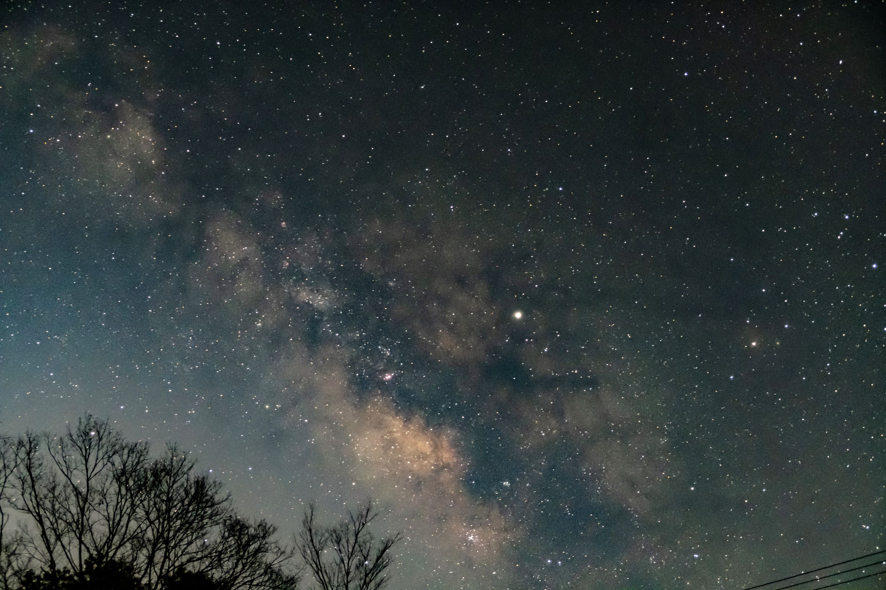
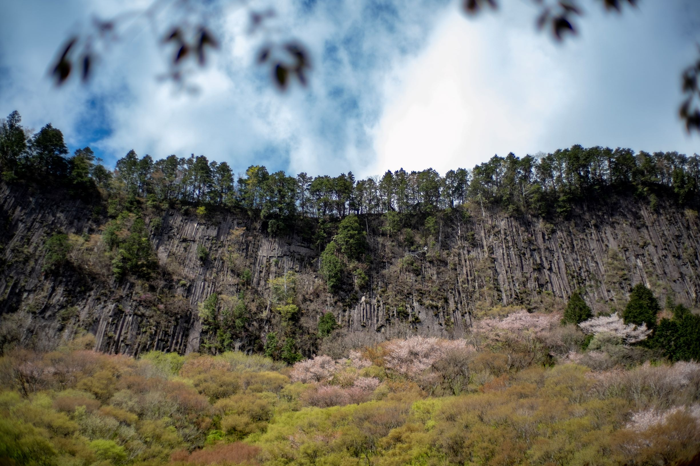
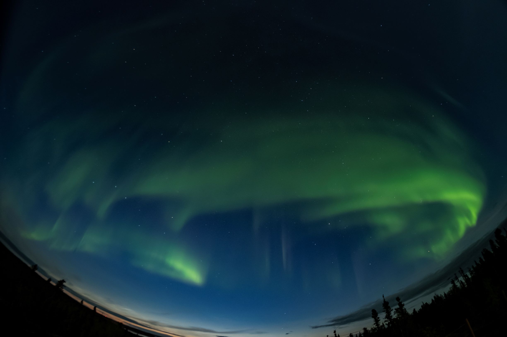
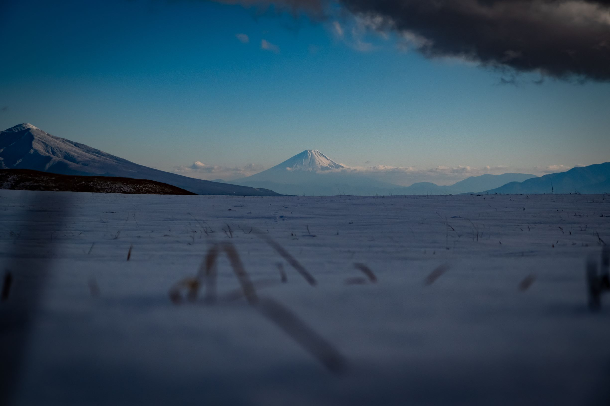
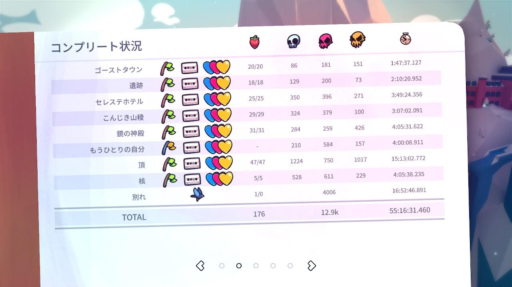

久しぶりに 1 年を振り返る記事を投稿してみようと思います。

## 今年の出来事

### 1Q(1 月から 3 月)

- 名古屋でスマブラ合宿したり食い倒れたりする
- 和歌山の橋杭岩へ写真を撮りに行く
- 滋賀の余呉湖へ写真を撮りに行く
- 福岡へ Evo Japan 2019 を観戦しに行く
- 奈良の高野山へ星空を撮りに行く
  

### 2Q(4 月から 6 月)

- 異動で京都勤務になる
- ビジネススクール前半戦開始で死にそう
- 奈良の吉野山へ桜を撮りに行く
- 奈良の屏風岩公苑へ桜を撮りに行く
  
- 御嶽山からの高ボッチ高原 (661km, 10:50)
- 京都で[BitSummit 7 Spirits](https://bitsummit.org/ja/)を観に行く
  - IGN Japapan 主催の公開収録イベント [しゃべりすぎ NIGHT@BitSummit 2019](https://jp.ign.com/gamer-1/35452/news/gamernightbitsummit2019531)にも参加する

### 3Q(7 月から 9 月)

- ビジネススクール後半戦開始で死にそう
- 仕事の都合で温泉旅館に約 1 週間滞在する。役得。
- ついに 0x20 歳となり成人する
- 人生 2 度目の海外、カナダのイエローナイフにてオーロラリベンジ成功
  
- 長野の御嶽山に行く(563km, 10:45)
- このあたりから仕事が忙しくなり始める
- [Celeste](http://www.celestegame.com/)の最終章がリリースされ、引き籠って遊ぶ
- 広島の尾道にラーメンを食べに行く(614km, 09:20)

### 4Q(10 月から 12 月)

- 忙しかったプロジェクトが何とか終了。精神的に辛かったが得たものも多い
- 奈良の曽爾高原に写真を撮りに行く
- 余呉湖、諏訪湖、精進湖(富士山)を回って帰る(683km, 11:21)
- [Clickhouse Meetup Tokyo 2019](https://clickhouse.connpass.com/event/147001/)に参加する
- いいことがある
- 滋賀の鶏足寺に写真を撮りに行く
- 長野の霧ヶ峰高原に写真を撮りに行く(634km, 10:20)
  

## 今年遊んだ/遊んでいるゲーム

- [beatmania IIDX Rootage/HEROIC VERSE](https://p.eagate.573.jp/game/2dx/27/top/index.html)
- [pop'n music peace](https://p.eagate.573.jp/game/popn/peace/p/index.html)
- [大乱闘スマッシュブラザーズ SPECIAL](https://www.smashbros.com/ja_JP/)
- [返校 -Detention-](https://redcandlegames.com/detention/)
- [Minit](https://minitgame.com/)
- [Night in the Woods](http://www.nightinthewoods.com/)
- [GRIS](https://nomada.studio/)
- [ゼルダの伝説 ブレス オブ ザ ワイルド](https://www.nintendo.co.jp/zelda/index.html)
- [Muse Dash](http://www.peroperogames.com/)
- [Dead Cells](https://dead-cells.com/)
- [Celeste(Chapter9)](http://www.celestegame.com/)
- [MO:Astray](https://www.moastray.game/en)
- [ゼルダの伝説 夢をみる島(Switch)](https://www.nintendo.co.jp/switch/ar3na/)
- [ポケットモンスター ソード・シールド](https://www.pokemon.co.jp/ex/sword_shield/)
- [十三機兵防衛圏](http://13sar.jp/)

アーケードゲームは目に見えてプレイ頻度が減った。

漏れてるゲームがあるかも。(明らかに、 買ったゲーム数 > プレイしたゲーム数 になっている・・・)

## 今年作ったもの

- [tac0x2a/lake_weed](https://github.com/tac0x2a/lake_weed)
  JSON をいい感じに型推定してくれるライブラリ
- [tac0x2a/grebe](https://github.com/tac0x2a/grebe)
  RabbitMQ に投げられた JSON をいい感じに Clickhouse へ挿入する OSS

その他は Private なリポジトリにガンガンコミットしている時期があった。

## 今年頑張ったこと

- AWS 認定の 5 冠をとったこと
- ビジネススクールに半年通い切ったこと
- Celeste ですべてのハートを回収したこと。Celeste は久しぶりに熱中できたゲーム。
  

## 雑感

- 今年はダラダラと過ごしてしまい、あまり作れなかった。
  かといって input が多かったわけでもなく、後で車輪に達していない何かを最発明していたことに気づくことも。

- とりあえず Youtube とか、Prime Video とかやってたのが良くなかった。

- こんな仕事したいなーと思っていたものに「データエンジニア」という名前が付いていることを知る。
  まずは直近 3 年くらいで基礎を吸収していきたい。

- フレームワークや体系化された知識の強力さを体感した。
  考えを整理し、それを安心感をもって人に説明できる。
  守破離の守。同じようなことをもっと深く考えている人達が必ずいる。巨人の肩に乗るべし。
  フレームワーク自体を考えるのが大変で、価値がある。

## 2020 年どうするか

- [DMBOK](http://www.dama-japan.org/)をとにかく一通り読むぞ
- 本を年間で 6 冊以上読むぞ
- 痩せていくぞ
