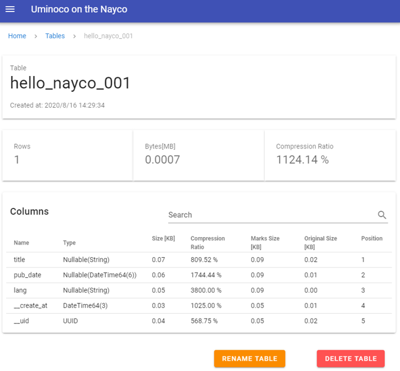
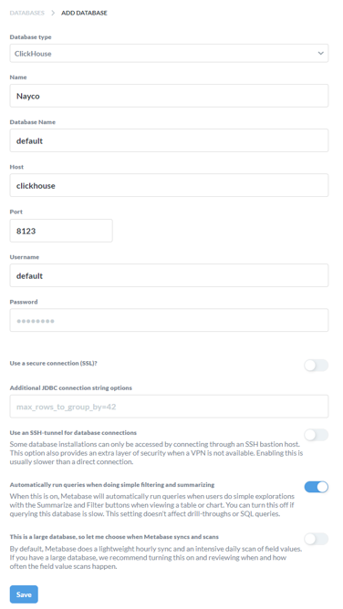
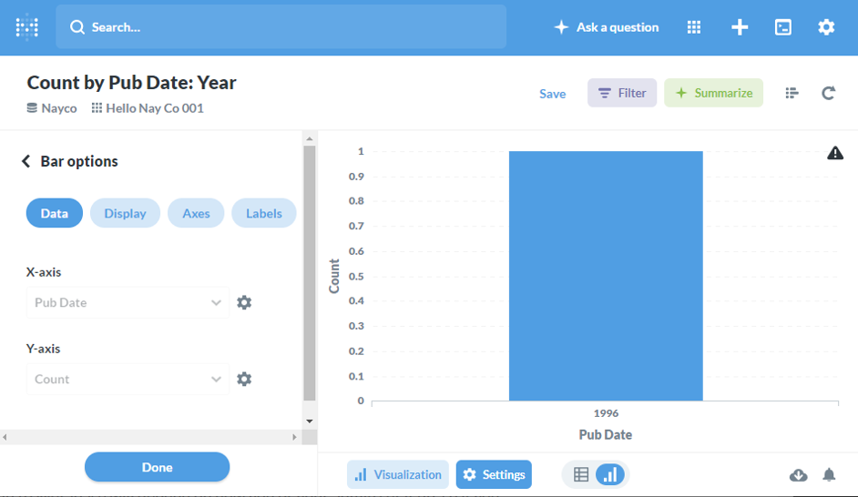
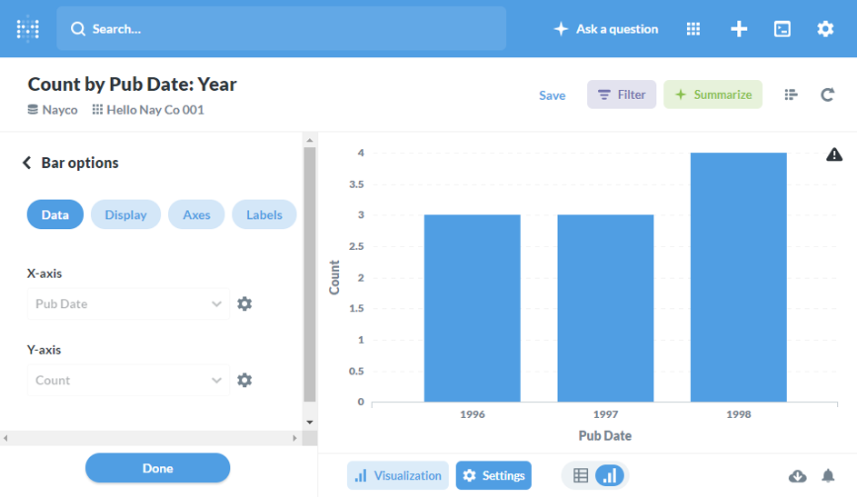

## Nayco とは？

Naycoは主にオンプレミスのデータ収集・蓄積・可視化環境を素早く立ち上げるための、オールインワンの小さなデータ基盤です。

[](https://github.com/tac0x2a/nayco)

[tac0x2a/nayco](https://github.com/tac0x2a/nayco)

\#アイコンはパワポで頑張って描きました

## 主な特徴
+ Dockerコンテナ群で構成され、`docker-compose` コマンド一発で起動
+ 列指向DWH([ClickHouse](https://clickhouse.tech/))による、高速な集計とデータ圧縮による高いストレージ効率
+ 入力データを元にスキーマを推定し、自動でDWHにテーブルを作成。データに合わせてテーブルを作成する必要はありません。
+ 構成するソフトウェアは全てOSS

`docker-compose` コマンドで立ち上げたあとは、共有フォルダにファイルを置いたりMQTTでデータを送信するだけで、DWHへ自動でデータが蓄積され、[Metabase](https://www.metabase.com/)や一般的なツールによってデータを利用することができます。


## Nayco の概要


Naycoは、データの入力、変換、蓄積、可視化のためのソフトウェア群によって構成されています。
基本の入力はMQTTで、JSON, JSONL, またはヘッダ付きCSV形式のデータを受け付けます。ヘッダなしのCSVフォーマットはサポートされません。
ファイルによる入力も可能で、所定のフォルダに上記形式のファイルを置くか追記することで、同様にデータを入力できます。

入力されたデータは内部のブローカーを経由し、DWHへ保存されます。このとき、データから推定された型を元に、自動的にテーブルが作成されます。

DWHへ格納されたデータは、Naycoが内蔵する可視化サービスを用いて分析やダッシュボードを作ったり、外部のSQLクライアントから直接データを利用することができます。

その他、コンテナの管理ツールや、DWHのテーブルを管理するツールが含まれています。

詳細については [Usage.ja.md](https://github.com/tac0x2a/nayco/blob/master/doc/Usage.ja.md) を参照してください。


## なぜ Nayco を作ったのか？
いわゆるデータ基盤は、クラウドのオブジェクトストレージや分散処理基盤のマネージドサービスなどを組み合わせて構築するのが一般的ですが、インターネットとの接続が困難な環境でデータ収集/分析をスモールスタートしたい、という人たちが案外います。(私もそう)

このようなケースにおいて、私の経験では小規模なツールやRDBを組み合わせたシステムを、個別のエンジニアリングで構築&スタートすることが多いのですが、収集データの項目を追加するたびにテーブルのメンテナンスが必要になったり、非力なハードウェアでは十分な性能が出ないなど、色々と苦労が多かったです。

そこで、データ項目が多少変化してもエンジニアリングレスでいい感じにデータを貯め続けてくれる仕組みと、オンプレのマシンでも性能が期待できるClickHouseを使ったデータ基盤を爆速で構築できる環境がほしい！という思いで、この Nayco を作りました。

--------------------------------------------------------------------------------
## とりあえず動かしてみる
### 1. 起動
```sh
$ docker -v
Docker version 19.03.12

$ docker-compose -v
docker-compose version 1.26.2
```

```sh
$ git clone https://github.com/tac0x2a/nayco.git
$ cd nayco
$ docker-compose up -d
```
上記でNaycoが起動します。各コンテナの状態は Portainer(`http://<NAYCO_HOST>:19000` )にアクセスして確認することができます。

なお、`<NAYCO_HOST>` は Naycoが実行されているホストまたはIPアドレスに読み替えてください。

### 2. サンプルデータの入力
ここでは、MQTTでJSONを送信してデータを入力してみます。

以下のデータをMQTTでNaycoへ送信します。
+ Topic: `hello/nayco`
+ Payload: `{"title": "The Perfect Insider", "pub_date": "1996/4/5", "lang": "ja"}`
+ Host: `<NAYCO_HOST>`
+ Port: `1883`


Pythonの例
```py
import paho.mqtt.publish as pub

topic = "hello/nayco"
payload = '{"title": "The Perfect Insider", "pub_date": "1996/4/5", "lang": "ja"}'
hostname = "<NAYCO_HOST>"
port = 1883

pub.single(topic=topic, payload=payload, hostname=hostname, port=1883)
```


### 3. データの確認

送信が完了したら、以下のデータ管理サービスでテーブルが作成されたことを確認します。
+ Uminoco: `http://<NAYCO_HOST>:5000/table/hello_nayco_001`

  

データとtopic名を元にテーブルが自動作成されていることを確認できます。
テーブル名はtopic名を元に生成されますが、`RENAME TABLE` ボタンから変更することができます。
今はデータが1件だけなので圧縮率が悪く見えますが、データが増えるにつれて、ClickHouseによるデータ圧縮が効果を発揮します。


### 4. データの可視化
蓄積したデータを可視化するサービスとして、Naycoには[Metabase](https://www.metabase.com/) が含まれています。
+ Metabase: `http://<NAYCO_HOST>:3000`

Metabaseを利用するためには、初回アクセス時に、DWH(ClickHouse)のDBをデータソースとして登録する必要があります。
+ Database type `ClickHouse`,
+ Database Name: 任意
+ Host: `clickhouse`
+ Port: `8123`
+ Database user name: `default`
+ Database password: <空>



上記をSaveして、Naycoに蓄積されたデータをMetabseで可視化する準備が整いました。(Metabaseのクロールが実行されるまでの間、実際のテーブルがMetabase上に表示されない場合があります)
試しに、簡単な可視化をしてみましょう。Metabase上で `hello_nayco_001` テーブルが見えるようになったので、以下のようなチャート(Question)を作成します。
Metabaseの使い方については、[Metabaseのドキュメント](https://www.metabase.com/docs/latest/getting-started.html)を参照してください。



横軸を公開日、縦軸を件数とするバーチャートです。今は1件しかデータが登録されていないので、シンプルな見た目です。

以下のようなスクリプトを実行し、データを追加してみます。

Pythonの例
```py
import paho.mqtt.publish as pub

topic = "hello/nayco"
payload = """
{ "title": "Doctors in Isolated Room", "pub_date": "1996/7/5", "lang": "ja" }
{ "title": "Mathematical Goodbye",     "pub_date": "1996/9/5", "lang": "ja" }
{ "title": "Jack the Poetical Private","pub_date": "1997/1/5", "lang": "ja" }
{ "title": "Who Inside",               "pub_date": "1997/4/5", "lang": "ja" }
{ "title": "Illusion Acts Like Magic", "pub_date": "1997/10/5","lang": "ja" }
{ "title": "Replaceable Summer",       "pub_date": "1998/1/7", "lang": "ja" }
{ "title": "Switch Back",              "pub_date": "1998/4/5", "lang": "ja" }
{ "title": "Numerical Models",         "pub_date": "1998/7/5", "lang": "ja" }
{ "title": "The Perfect Outsider",     "pub_date": "1998/10/5","lang": "ja" }
"""
hostname = "<NAYCO_HOST>"
port = 1883

pub.single(topic=topic, payload=payload, hostname=hostname, port=1883)
```

その後、Metabaseのページをリロードすると追加されたデータが表示されます。




このように、MQTTでデータを送信するだけで、簡単に可視化が可能です。その他、任意のSQLクライアントでDWHを直接クエリしたり、ファイルとしてエクスポートすることが可能です。

その他詳細については [Usage.ja.md](https://github.com/tac0x2a/nayco/blob/master/doc/Usage.ja.md) を御覧ください。

--------------------------------------------------------------------------------
## 今後
+ (特に)DWHのDB名や認証認可がガバガバなので、もう少しまともにしたい
+ データマートを構成するためのETLっぽい仕組みの導入。
  Node-Redでそれっぽいことも頑張れ無くないが、Embulkをブラウザからキックするようなサービスを入れたい。

## 最後に
[ClickHouse](https://clickhouse.tech/)はいいぞ！