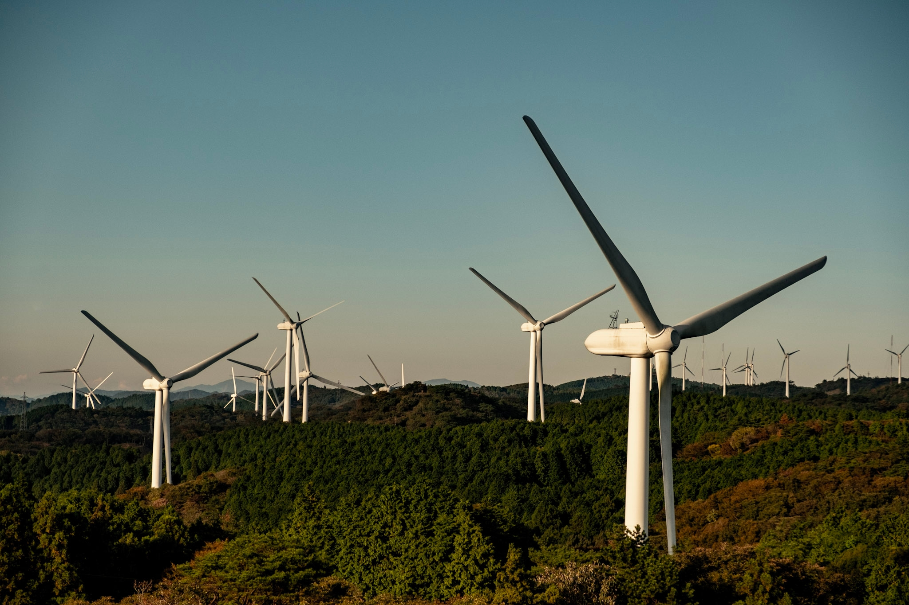

今年も一年を振り返っていきたいと思います。

## 今年の出来事

### 1Q(1 月から 3 月)
- 金沢でお肉とお寿司を食べながらご報告する
- 出張の帰りに寄った東京タワーで、日没まで2時間くらいボーっとする
- 顔合わせイベントを乗り切る
- 約8年住んだ部屋から引っ越しし、同居人が増える。
  - プロの引っ越し技術はすごい
  - インターネットの速度が0.1倍くらいになった
  - 同居人の作ってくれるご飯が美味しい
- 京都の地下鉄駅から人が消え始め、COVID-19の影響を身近に感じ始める
- フルリーモートの在宅勤務が本格化し始める
- 🚗 舞鶴まで赤レンガ倉庫を撮りに行く
  

### 2Q(4 月から 6 月)
- 同居人と入籍する。
- 洗濯機を買う。ボタン一つで洗剤入れて乾燥までしてくれるの最高。
- あまりに出かけられず、ベランダでキャンプグッズ広げてコーヒー飲みながら本を読んで過ごす
- [BitSummit Gaiden](https://bitsummit.org/gaiden-map/)に参加
- 🚗 長野の御嶽山に行く
- 🚗 伊吹山に登る
  

### 3Q(7 月から 9 月)
- 🚗 和歌山の白浜にマグロを食べに行く
- 20年ぶりくらいにポケモンカードを買ってしまう。構築済みデッキ同士で遊ぶのが楽しい。
- [趣味で作っていたデータ基盤](https://www.tac42.net/post/2020-08-17-nayco-first-release/)の[Nayco](https://github.com/tac0x2a/nayco)をリリースする
- 仕事終わりのウォーキングが楽しい
- お仕事で大きめのマイルストーンを通過する
- 🚗 長野の御嶽山に行く
  

### 4Q(10 月から 12 月)
- [このMOTHERのカバー](https://www.1101.com/store/techo/ja/2021/pc/detail_cover/oc20_mothercast/)を使いたいがために、数年ぶりにほぼ日手帳を買って使い始めた。最近は[day-free](https://www.1101.com/store/techo/ja/2021/all_about/dayfree/)というのもあって、書きたいときだけ書けるので気持ちが楽。
- 🚗 長野の諏訪湖に行く
- 🚗 三重の青山高原に行く
- 🚗 長野の霧ヶ峰高原に行く
- 🚗 金沢のポケモンセンターに行く
- IGN Japanのオンラインイベント [しゃべりすぎNIGHT ONLINE](https://eventregist.com/e/IGNJAPAN-online?lang=ja_JP)に参加する
- [クイーンズ・ギャンビット](https://www.imdb.com/title/tt10048342/)を見るためにNetflixと契約してしまう
- 🚗 滋賀の余呉湖に写真を撮りに行く
- [ぴよりーな1号](http://www.hiyokono-okage.jp/)というクレーンゲームにハマり、設置場所の調査を始める。
- 🚗 浜名湖、富士山、諏訪湖、妙高を回って帰る(1032km, 11:59)
  

## 今年遊んだ/遊んでいるゲーム

- [beatmania IIDX HEROIC VERSE/BISTROVER](https://p.eagate.573.jp/game/2dx/28/top/index.html)
- [pop'n music peace/解明リドルズ](https://p.eagate.573.jp/game/popn/riddles/index.html)
- [Celeste(Glyph)](http://www.celestegame.com/) ⏸
- [ポケットモンスター ソード・シールド(エキスパンションパス)](https://www.pokemon.co.jp/ex/sword_shield/) ⏸
- [Muse Dash](http://www.peroperogames.com/)
- [Life is Strange](https://www.jp.square-enix.com/lis/)
- [Untitled Goose Game](https://goose.game/jp/) ⏸
- [Baba Is You](https://www.hempuli.com/baba/) ⏸
- [アンリアルライフ](https://www.unreal-life.net/)
- [マリオテニス エース](https://www.nintendo.co.jp/switch/alera/index.html)
- [FINAL FANTASY VII REMAKE](https://www.jp.square-enix.com/ffvii_remake/)
- [GNOSIA](http://d-mebius.com/gnosias/)
- [Coffee Talk](https://www.togeproductions.com/project/coffee-talk/)
- [Factorio](https://factorio.com/)
- [Terraria](https://terraria.org/)
- [聖剣伝説3 TRIALS of MANA](https://www.jp.square-enix.com/seiken3_tom/) ⏸
- [Portal](https://store.steampowered.com/app/400/Portal/)
- [Necrobarista](https://www.necrobarista.com/)
- [Neo Cab](https://neocabgame.com/) ⏸
- [Carto](http://press.sunheadgames.com/sheet.php?p=carto)
- [Slay the Spire](https://www.megacrit.com/)
- [Crown Trick](https://www.nextstudios.com/crowntrick/index_en.html)
- [Timelie](https://timelie.urniquestudio.com/) ⏸
- [桃太郎電鉄 〜昭和 平成 令和も定番!〜](https://www.konami.com/games/momotetsu/teiban/)
- [A Short Hike](https://adamgryu.itch.io/a-short-hike)
- [Tanuki Sunset](https://www.rewindgames.ca/) ⏸
- [はたらくUFO](https://www.nintendo.co.jp/switch/azd8a/) ⏸
- [Hotel Sowls](https://hotelsowls.com/ja/)

(⏸は未クリア)

- 個人的GOTYは[A Short Hike](https://adamgryu.itch.io/a-short-hike)、次点は[Necrobarista](https://www.necrobarista.com/)、[Carto](http://press.sunheadgames.com/sheet.php?p=carto)あたり。

- COVID-19の影響で、昨年にも増してアーケードのプレイ頻度が減った。

- インディーのゲームをPCではなくSwitch Liteで遊ぶことが増えた。

- 普段AAAタイトルを遊ばないので、[FF7リメイク](https://www.jp.square-enix.com/ffvii_remake/)のプレイ時間40H超はかなり疲れた。

- 年末に滑り込みで RTX 3070 と [Razer Core X](https://www2.razer.com/jp-jp/gaming-systems/razer-core-x) を買ったので、来年は更に快適にゲームを遊べるようになった。積んでる[Sekiro](https://www.sekiro.jp/)とか[Death Stranding](http://www.kojimaproductions.jp/death_stranding.html)とか遊びたい。

## 今年作ったもの
### [Nayco](https://github.com/tac0x2a/nayco)
オンプレでも動く小さなデータ基盤。データ収集・蓄積・可視化環境を素早く立ち上げるのに良い。[ドキュメント](https://github.com/tac0x2a/nayco/blob/master/doc/Usage.ja.md)と、[エントリも書いた](https://www.tac42.net/post/2020-08-17-nayco-first-release/)。

  

### [o-namazu](https://github.com/tac0x2a/o-namazu)
指定したディレクトリを再帰的に監視して、パターンに一致するファイルが更新されたら差分をMQTTで送信するエージェント。Naycoで使いたくて作った。

### [932mania](https://932mania.tac42.net)
Vue.js + Firebase で作ったお試しアプリ。Wikipediaをスクレイピングして、「草津」から始まる記事を表示します。

## 今年頑張ったこと
- [Nayco](https://github.com/tac0x2a/nayco)をリリースしたこと

- Vue.js でフロントエンドも書けるようになったこと。これでWebアプリを一人で開発できるようになったはず

- 英語圏のお客様とカンペ無しで打ち合わせできるようになったこと。

## 雑感
- 今年は入籍して生活が変わったので、勉強したり作ったりする意味では若干停滞気味な一年だった気がする。そんな中でも、[Nayco](https://github.com/tac0x2a/nayco)の開発を通して、久しぶりに寝る間も惜しんでコードを書きたくなる体験ができたのがとても良かった。

- 結局DMBOKは一通り読めなかった… というのをはじめ、こういったフワッとした目標の立て方だとうまく行かないというのがよくわかった一年だった。何らか細かく具体的なゴール設定を置いて取り組むのが大事と感じた一年。

- 本格的にデータエンジニアリングやるには、今の役割では難しいなと感じた一年だった。今年の組織は自分には合わなかったなぁ…心理的安全性のない組織では何をやってもダメ。

## 2021 年どうするか
- 今度こそ[DMBOK](http://www.dama-japan.org/)をとにかく一通り読んで、[CDMP](https://cdmp.info/)の認定を受けるぞ

- 潮目が変わってきたので、家族とキャリアの軸で身の振り方を真剣に考えるぞ

- 体型を維持するぞ

\# 今年の一枚は、伊吹山登った帰りに寄った琵琶湖
