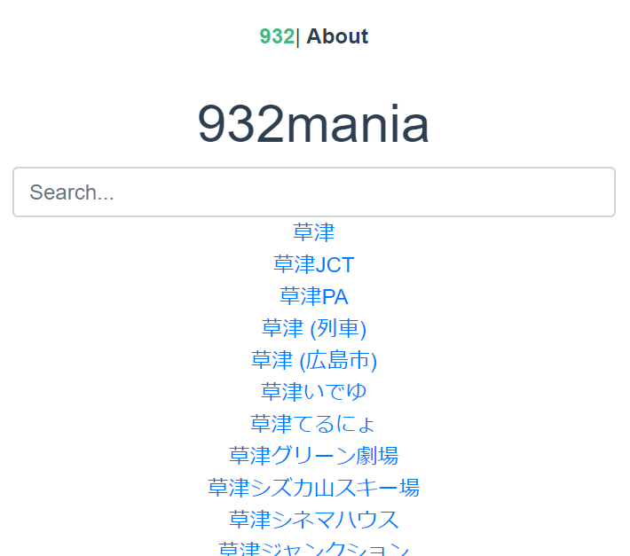
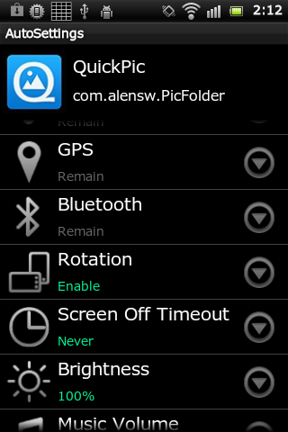
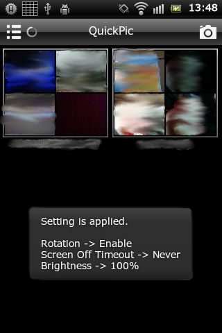

作ったものとか．

---
## [Nayco](https://github.com/tac0x2a/nayco)

[](https://github.com/tac0x2a/nayco)

[tac0x2a/nayco](https://github.com/tac0x2a/nayc)

雑にMQTT投げたりCSVファイル置くだけで、いい感じにDWHへ蓄積してダッシュボード作れるなんちゃってオンプレデータ基盤です。自分のデータエンジニアリングを楽にするために作りました。詳しくは[こちら](/post/2020-08-17-nayco-first-release/)。


Naycoの中で動く以下のOSSも作りました。
+ [Grebe](https://github.com/tac0x2a/grebe): RabbitMQから受け取ったJSON/CSVテキストをいい感じにClickHouseへ蓄積する
+ [Lake Weed](https://github.com/tac0x2a/lake_weed): JSON/CSV のテキストを受け取って、いい感じにClickHouseの型へマッピングするライブラリ。Grebeの中で使っています。そのうちClickHouse以外のDBMSにも対応したい。
+ [o-namazu](https://github.com/tac0x2a/o-namazu): フォルダを監視して、ファイルが置かれたり追記されたら差分をMQTTで送信するデータシッパー。設定ファイルを置くだけで、フォルダごとの監視条件を設定できる。
+ [Uminoco](https://github.com/tac0x2a/nayco/tree/master/uminoco): Grebeで貯めたClickHouse上のデータを見たりテーブル操作するためのサービス。テーブルがいつ作られて、どれくらいのサイズになっていて、最新の値や最近のデータ件数をヒートマップで見れるなど、便利そう！と思う機能を適当に入れています。


---
## [932mania](https://932mania.tac42.net)


[932mania](https://932mania.tac42.net)

[github.com/tac0x2a/932mania](https://github.com/tac0x2a/932_mania)


Vue.js + Firebase で作ったお試しアプリ。Wikipediaをスクレイピングして、「草津」から始まる記事を表示します。


---
## [Yasuri](https://github.com/tac0x2a/yasuri)
Webスクレイピング処理を宣言的に記述するためのRubyライブラリです．

```ruby
require 'yasuri'
require 'machinize'

# Node tree constructing by DSL
root = Yasuri.links_root '//*[@id="menu"]/ul/li/a' do
         text_title '//*[@id="contents"]/h2'
         text_content '//*[@id="contents"]/p[1]'
       end

agent = Mechanize.new
root_page = agent.get("http://some.scraping.page.net/")

result = root.inject(agent, root_page)
# => [ {"title" => "PageTitle1", "content" => "Page Contents1" },
#      {"title" => "PageTitle2", "content" => "Page Contents2" }, ...  ]

```


よくある以下のような処理を、宣言的に、簡単に記述することができます．

+ ページ内の複数のリンクを開いて、各ページをスクレイピングした結果をHashで取得する
+ ページ内の複数のテキストをスクレイピングし、名前をつけてHashにする
+ ページ内に繰り返し出現するテーブルをそれぞれスクレイピングして、配列として取得する
+ ページネーションで提供される各ページのうち、上位3つだけを順にスクレイピングする

[github.com/tac0x2a/yasuri](https://github.com/tac0x2a/yasuri)

---
## [AutoSettings](https://play.google.com/store/apps/details?id=net.tac42.auto_settings)
起動しているアプリやシステムの状態に応じて設定を自動で切り替えるAndroidアプリです．




---
## [Droid Jammer](https://play.google.com/store/apps/details?id=jp.dip.wt.lmm)
顔認識ライブラリを利用して，画像中の顔を隠すAndroidアプリです．


